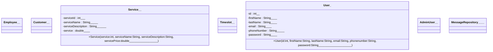

# Class Diagram

```mermaid
    classDiagram
        
        class Employee__{
            
        }
        class Customer__{
            
        }
        class Service__{
            -serviceId : int___
            -serviceName : String_____
            -serviceDescription : String______
            -service : double____
            +Service(service:int, serviceName:String, serviceDescription:String, servicePrice:double__________________)
        }
        class Timeslot__{
            
        }
        class User_{
            -id : int__
            -firstName : String____
            -lastName : String____
            -email : String____
            -phoneNumber : String_____
            -password : String____
            +User(id:int, firstName:String, lastName:String, email:String, phonenumber:String, password:String_____________________)
            
        }
        class AdminUser__{
            
        }
        class MessageRepository____{
            
        }
        

```