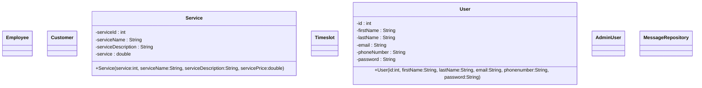

# Class Diagram

```mermaid
    classDiagram
        
        class Employee{
            
        }
        class Customer{
            
        }
        class Service{
            -serviceId : int
            -serviceName : String
            -serviceDescription : String
            -service : double
            +Service(service:int, serviceName:String, serviceDescription:String, servicePrice:double)
        }
        class Timeslot{
            
        }
        class User{
            -id : int
            -firstName : String
            -lastName : String
            -email : String
            -phoneNumber : String
            -password : String
            +User(id:int, firstName:String, lastName:String, email:String, phonenumber:String, password:String)
            
        }
        class AdminUser{
            
        }
        class MessageRepository{
            
        }
        

```