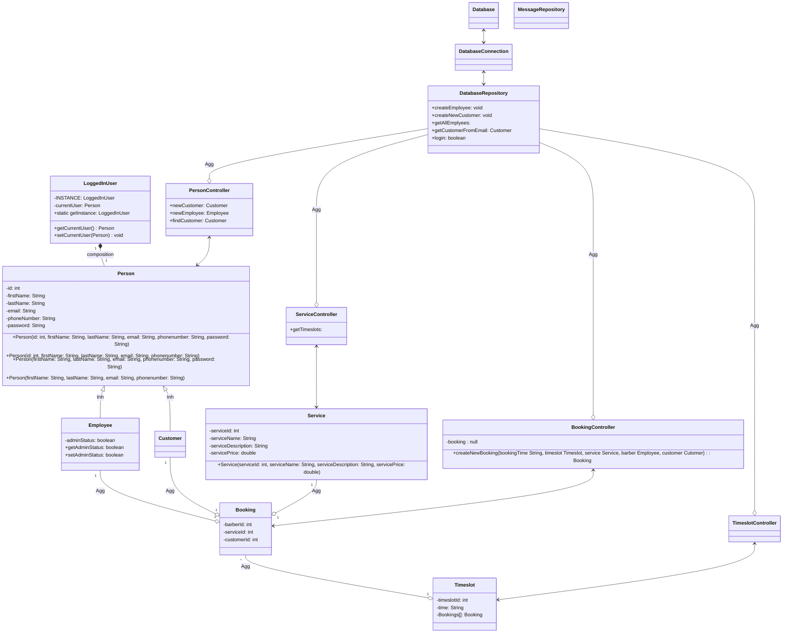

# Class Diagram

```mermaid
    classDiagram
    Person <|-- Employee: Inh
    Person <|-- Customer: Inh
    LoggedInUser "1" *-- "1" Person: composition
    Employee "1" --o "1" Booking: Agg
    Customer "1" --o "1" Booking: Agg
    Service "1" --o "1" Booking: Agg
    Booking "*" --o "1" Timeslot: Agg
    
    Database <--> DatabaseConnection
    DatabaseConnection <--> DatabaseRepository
    DatabaseRepository --o PersonController: Agg
    DatabaseRepository --o ServiceController: Agg
    DatabaseRepository --o TimeslotController: Agg
    DatabaseRepository --o BookingController: Agg
    
    PersonController<-->Person
    ServiceController<-->Service
    TimeslotController<-->Timeslot
    BookingController<-->Booking
    
    class Person {
        -id: int
        -firstName: String
        -lastName: String
        -email: String
        -phoneNumber: String
        -password: String
    %% Used for getting Employees and Customers with ID
        +Person(id: int, firstName: String, lastName: String, email: String, phonenumber: String, password: String)
        +Person(id: int, firstName: String, lastName: String, email: String, phonenumber: String)
    %% Used for making new Employees and Customers without ID
        +Person(firstName: String, lastName: String, email: String, phonenumber: String, password: String)
        +Person(firstName: String, lastName: String, email: String, phonenumber: String)
    }
    class Employee {
        -adminStatus: boolean
        +getAdminStatus: boolean
        +setAdminStatus: boolean
    }

    class Customer {
    }

    class Service {
        -serviceId: int
        -serviceName: String
        -serviceDescription: String
        -servicePrice: double
        +Service(serviceId: int, serviceName: String, serviceDescription: String, servicePrice: double)
    }

    class Booking {
        -barberId: int
        -serviceId: int
        -customerId: int
    }

    class Timeslot {
        -timeslotId: int
        -time: String
        -Bookings[]: Booking
    }

    class MessageRepository {
    }
    
    class DatabaseRepository {
        +createEmployee: void
        +createNewCustomer: void
        +getAllEmplyees: <Employee>
        +getCustomerFromEmail: Customer
        +login: boolean
    }

    class LoggedInUser {
        -INSTANCE: LoggedInUser
        -currentUser: Person
        +static getInstance: LoggedInUser
        +getCurrentUser() Person
        +setCurrentUser(Person) void
    }
    
    class PersonController {
        +newCustomer: Customer
        +newEmployee: Employee
        +findCustomer: Customer
    }

    class ServiceController {
        +getTimeslots: <Timeslot>
    }

    class BookingController {
        -booking : null
        +createNewBooking(bookingTime String, timeslot Timeslot, service Service, barber Employee, customer Cutomer ): Booking
    }
    
    


```