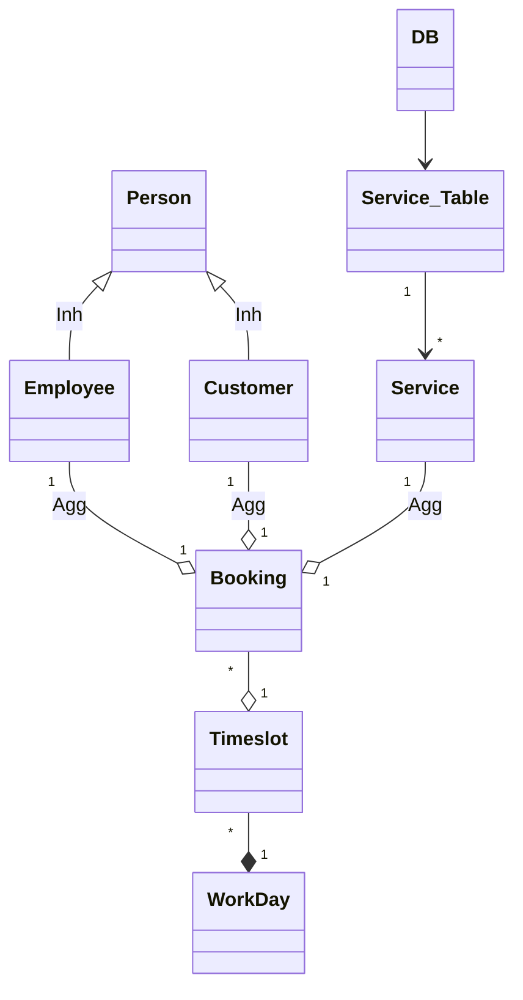

# Domain-model

```mermaid
    classDiagram
    Person <|-- Employee: Inh
    Person <|-- Customer: Inh
    Employee "1" --o "1" Booking: Agg
    Customer "1" --o "1" Booking: Agg
    DB --> Service_Table
    Service_Table "1" --> "*" Service
    Service "1" --o "1" Booking: Agg
    Booking "*" --o "1" Timeslot
    Timeslot "*" --* "1" WorkDay


```

