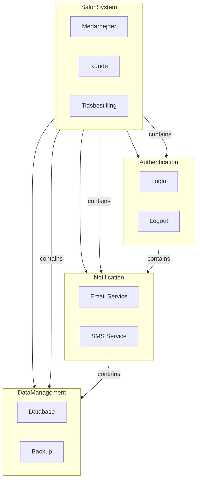

```mermaid
graph TD
    A[SalonSystem] --> B[Authentication]
    A --> C[Notification]
    A --> D[DataManagement]

    subgraph A[SalonSystem]
        Medarbejder[Medarbejder]
        Kunde[Kunde]
        Tidsbestilling[Tidsbestilling]
    end

    subgraph B[Authentication]
        Login[Login]
        Logout[Logout]
    end

    subgraph C[Notification]
        EmailService[Email Service]
        SMSService[SMS Service]
    end

    subgraph D[DataManagement]
        Database[Database]
        Backup[Backup]
    end

%% Define relationships between the main system and sub-graphs
    A -->|contains| B
    A -->|contains| C
    A -->|contains| D
    B -->|contains| C
    C -->|contains| D
```
