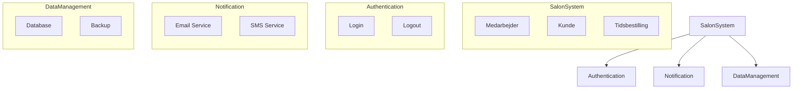

```mermaid
graph TD
    A[SalonSystem] --> B[Authentication]
    A --> C[Notification]
    A --> D[DataManagement]

    subgraph SalonSystem
        direction TB
        Medarbejder[Medarbejder]
        Kunde[Kunde]
        Tidsbestilling[Tidsbestilling]
    end

    subgraph Authentication
        direction TB
        Login[Login]
        Logout[Logout]
    end

    subgraph Notification
        direction TB
        EmailService[Email Service]
        SMSService[SMS Service]
    end

    subgraph DataManagement
        direction TB
        Database[Database]
        Backup[Backup]
    end
```