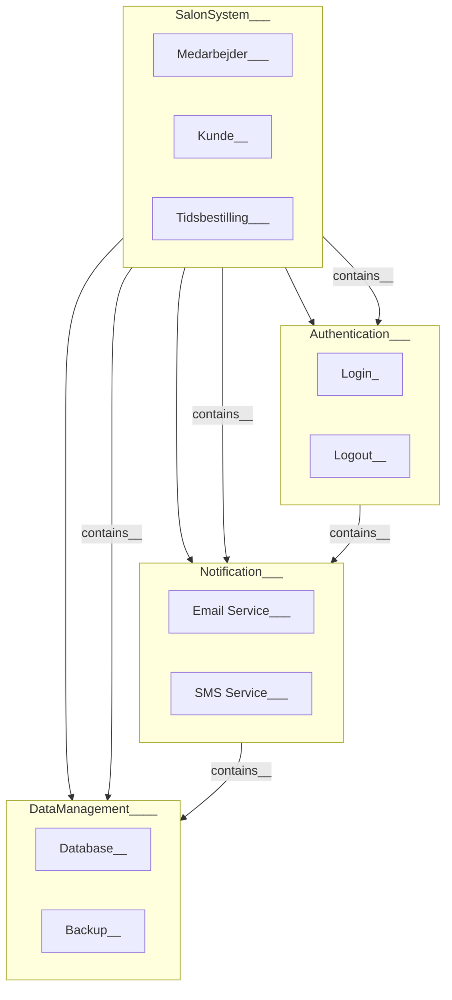

```mermaid
graph TD
    A[SalonSystem] --> B[Authentication]
    A --> C[Notification]
    A --> D[DataManagement]

    subgraph A[SalonSystem___]
        Medarbejder[Medarbejder___]
        Kunde[Kunde__]
        Tidsbestilling[Tidsbestilling___]
    end

    subgraph B[Authentication___]
        Login[Login_]
        Logout[Logout__]
    end

    subgraph C[Notification___]
        EmailService[Email Service___]
        SMSService[SMS Service___]
    end

    subgraph D[DataManagement____]
        Database[Database__]
        Backup[Backup__]
    end

%% Define relationships between the main system and subgraphs
    A -->|contains__| B
    A -->|contains__| C
    A -->|contains__| D
    B -->|contains__| C
    C -->|contains__| D
```
