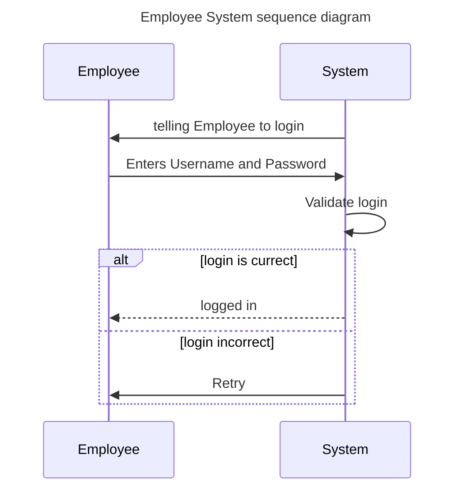

### Employee Login

## Usecase
Precondition: not logged in

Process: As an employee i need to log in with credentials given by a system admin,
to gain access to the system. As an employee I enter my username and password, I would then have access to the system.

Postcondition: logged in

## System-Sequence-diagram

